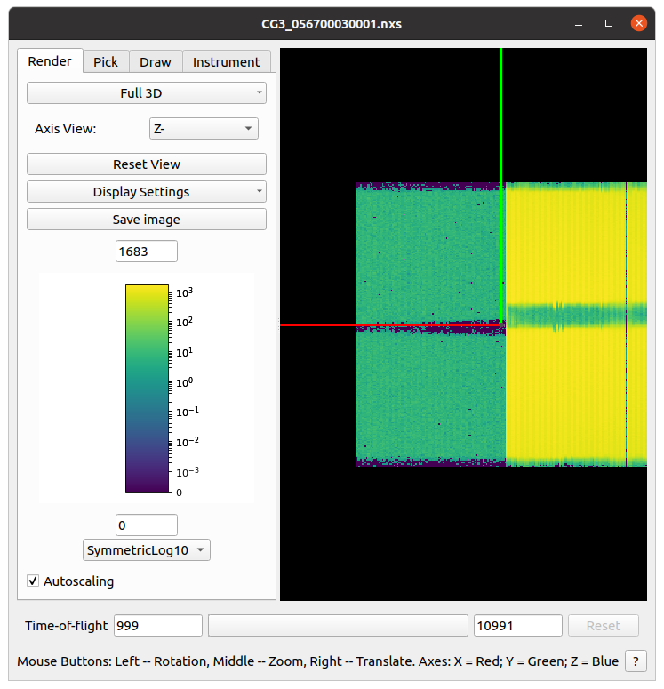
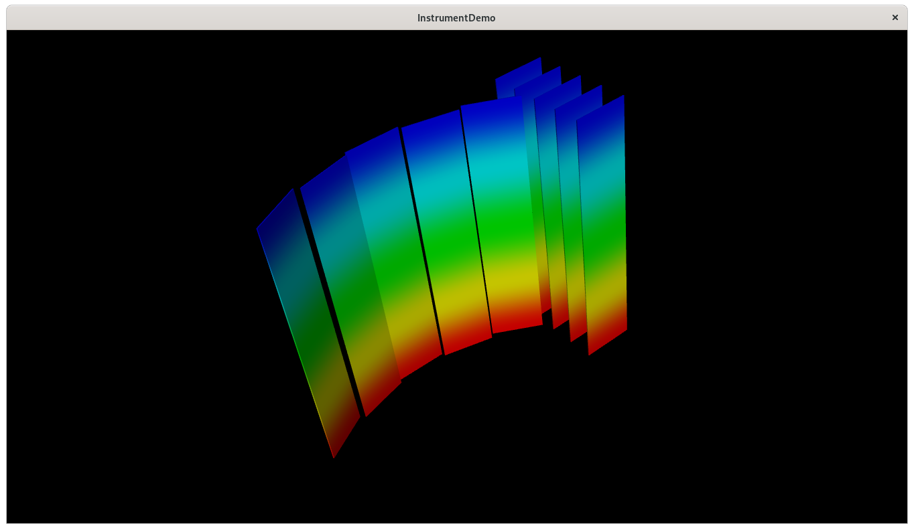

# Cross Platform Graphics Evaluation

## Glossary of Terms

- ADS (Analysis Data Service): The in memory store for data within Mantid
- Workspace: Proprietary data container used within Mantid
- OpenGL: Long standing graphics API published by The Khronos Group
- Qt/The Qt Company: Application framework (and the vendor of said framework) that is heavily used for graphical aspects of Mantid

## Background

The [Instrument View](https://docs.mantidproject.org/nightly/workbench/instrumentviewer.html) is a tool within Mantid that allows viewing a 3D representation of an instrument, typically but not limited to the sample position, monitors and detectors.
This can be a significant assistance during commissioning/diagnostics and for certain data reduction workflows.

The continued use of OpenGL for 3D rendering (primarily in the Instrument View) is a cause for concern.

- Apple deprecated OpenGL on all platforms (on macOS 10.14) in favour of Metal
- OpenGL is typically the worst performing graphics API
- OpenGL is not a pleasant API, which gives rise to readability and performance issues in the Instrument View code

To rectify the above issues the Instrument View code should be refactored to use a new API (be it a graphics API or higher level).

### Current Implementation

Like other GUIs in Mantid the Instrument View is developed using the Qt framework which provides the graphical interface functionality.
The current implementation of the 3D graphics in the Instrument View uses mostly custom code built on top of OpenGL.
The 3D graphics are embedded into a Qt window using `QGLWidget` (which is itself a deprecated API within Qt).
The following are the main classes/functions involved in rendering an instrument:

`MantidGLWidget` and `Projection3D` contain some OpenGL initialisation and common functionality, e.g. axis indicators.

`InstumentActor` is responsible for controlling interaction between the application and `InstrumentRenderer`.
This includes tasks such as: obtaining the workspace from the ADS, calculating data ranges and generating colour map, controlling visibility of components.

`InstrumentRenderer::renderInstrument()` wraps the construction of the instrument via the OpenGL API in a call list.
This is done to prevent the instrument being traversed each time the scene is rendered.

`InstrumentRenderer::draw()` performs the traversal of the instrument geometry and calls the draw function corresponding to they component type.

The following are functions that draw components of a certain type:
- `InstrumentRenderer::drawGridBank()`
- `InstrumentRenderer::drawRectangularBank()`
- `InstrumentRenderer::drawTube()`
- `InstrumentRenderer::drawStructuredBank()`
- `InstrumentRenderer::drawSingleDetector()`

Some of the above functions also use functionality in `BankRenderingHelpers`, which contains common functionality for converting component info to OpenGL API calls.

One thing to note is that there is no central location where the rendering happens.
This is one of the main factors in the current implementation being overly difficult to maintain.
Due to the nature of the OpenGL API it is split over several functions and mostly mixed in with the traversal of the instrument.
The use of call lists solve the performance issue that arises, however the entire instrument is traversed again even for small changes.

## Options Considered

### Vulkan

[Vulkan](https://www.khronos.org/vulkan/) is a graphics API, the specification of which is published by the Khronos Group.

Vulkan is designed to replace OpenGL and was designed to address many of it's shortcomings.
It has good compatibility with platforms supported by Mantid and typically outperforms the equivalent OpenGL implementation.

Pros:
- Not OpenGL
- Very platform/device agnostic
- Easy to embed in a Qt window

Cons:
- Limited high level functionality
  - Would still need to keep/modify code for custom bank representation, picking, etc.

### Qt3D

[Qt3D](https://doc.qt.io/qt-5/qt3d-overview.html) is an extension to the Qt framework that provides a high level 3D rendering API.

Qt3D provides a general purpose high level abstraction on top of the graphics API.
The API is based around a scene graph following the same style as `QWidgets` appear in a `QWindow`.

Pros:
- Can use Vulkan as the graphics API
- Easy to use, high level API

Cons:
- Is Qt
  - Given the [questionable choices made by The Qt Company effectively preventing open source use of their framework](https://www.theregister.com/2021/01/05/qt_lts_goes_commercial_only/) additional Qt component dependencies should be avoided
- API provides little application specific functionality
  - Representing detectors as objects is too memory and compute intensive
  - Representing banks as objects requires manual handling of textures and pixel selection (similar to what is done in the current implementation)

### VTK

[VTK](https://vtk.org/) (The Visualisation Toolkit) is a high level API for data visualisation published by Kitware.

VTK provides a wealth of abstractions from the graphics API specifically for the purpose of data visualisation and is widely used in other scientific data treatment software.

Pros:
- Very versatile
- Good performance
- Easy to embed in a Qt window
- Removes the need for custom code for certain aspects
  - Reduces development time and maintenance overhead

Cons:
- Currently only supports OpenGL
  - Vulkan support is in the works
    - https://discourse.vtk.org/t/vulkan-development/3307
    - https://discourse.vtk.org/t/update-on-vulkan-support/2819

## VTK

The Visualisation Toolkit (VTK) is a well established library for scientific visualisation.

It has in built support for many of the features required for the Instrument View:

- Abstractions over detector constructions
- Detector pixel picking
- Intensity mapping

The included demo application shows how these can be assembled to recreate the core visualisation functionality of the Instrument View:
- A `vtkRectilinearGrid` is used to represent a 2D detector panel
- A `vtkDataSetMapper` colours each cell based on it's intensity and a `vtkLookupTable`
- A custom `vtkInteractionStyle` is used to obtain the coordinates of a selected pixel and the bank it belongs to

A screenshot of the included demo is provided:

### Risks

The only significant risk involved with this approach is a potential lack of non-OpenGL renderers by the time OpenGL becomes unavailable on a platform we support.
As mentioned above, this is something being worked on and in the worst case it is unlikely that a platform will go unsupported for long given the range of other software in which VTK is used.
Despite not being in a "zero risk" situation through an adoption of VTK, the risk would be significantly reduced.

## Implementation within Mantid

### Overview

The majority of the work to replace the existing implementation likely resides within `InstrumentWidget`, `InstrumentRenderer` and each component type.
`InsturmentWidget` should handle the configuration of the VTK widget, interactor and additional functionality (e.g. axes, auxiliary controls).
`InstrumentRenderer` and each component type will change from just iterating over the components, to each component returning a `vtkActor` representing the specific part of the instrument.

## Next steps/roadmap

A potential roadmap for the implementation of a VTK based Instrument View in Mantid is given below.
Note that the durations are given in person weeks.

The majority of work in stages 1, 3 and 4 can be performed by multiple developers in parallel.
Stage 2 contains the foundation work of integrating VTK in Mantid, therefore a good amount of this will not distribute well over multiple developers.

The task of improving dependency management for Mantid is a prerequisite of stage 2, this removes a non trivial task from this project.

1. Demonstration using all bank types Mantid currently supports (6w)
  - Cylinder
  - Mesh

2. Bare minimum implementation of instrument rendering (18w)
  - All detectors rendered
  - Basic picking
  - Intensity mapping

3. Full rendering (8w)
  - Non detector components
  - Axes indicators
  - Intuitive interaction

4. Equivalent functionality (18w)
  - Match picking functionality
  - Other things I have overlooked?
